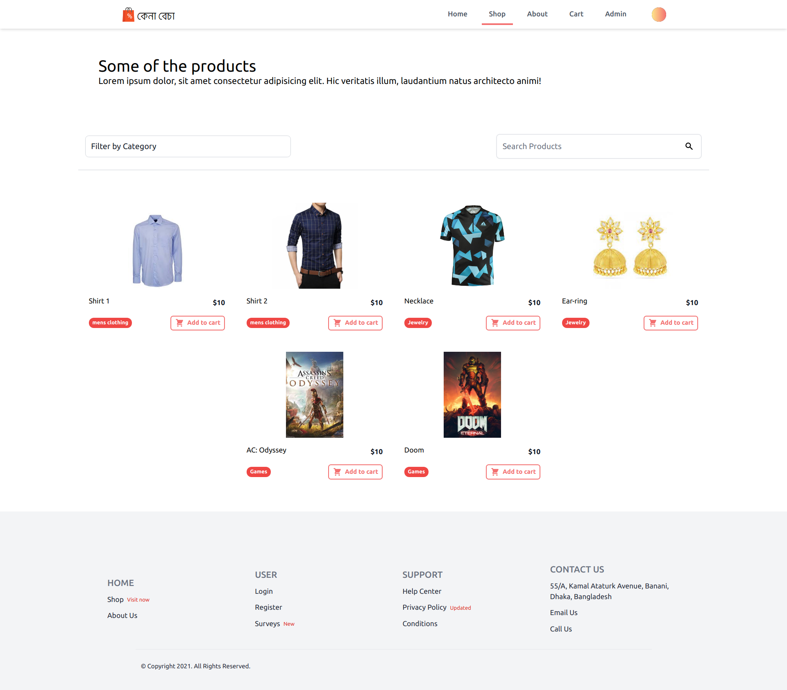
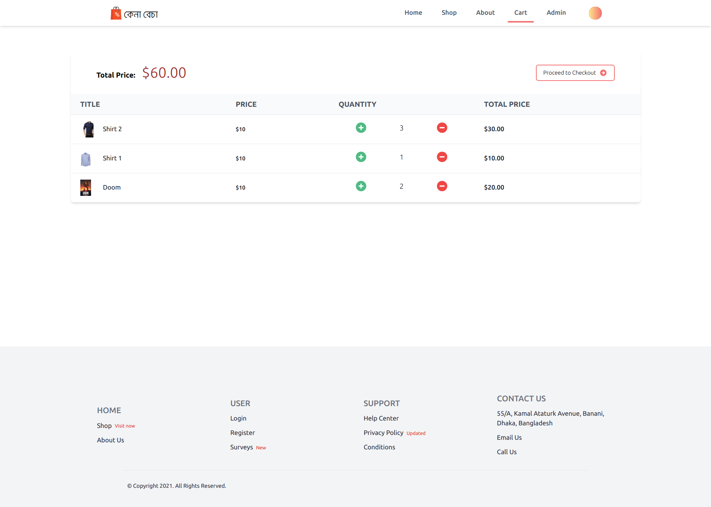
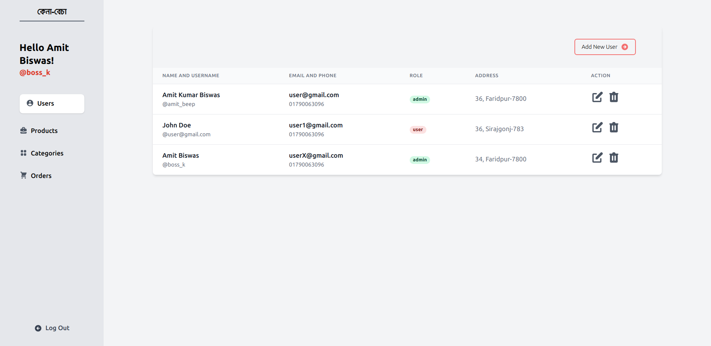
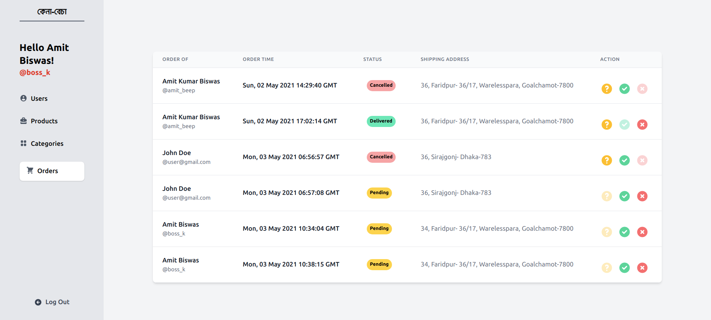

# Kena-Becha

Kena-becha is a simple e-commerce template made with react, react-router, redux-toolkit, tailwindcss, formik, etc.

## Run locally

-   Clone and run [fakecommerce](https://github.com/amitkbiswas01/fakecommerce) locally. Kena-becha uses this open-source node app as a backend.
-   Run these command

```bash
git clone https://github.com/amitkbiswas01/kena-becha.git
cd kena-becha
yarn install
yarn start
```

## Images and Icons:

-   [Flaticon](https://www.flaticon.com/)
-   [404](https://www.freepik.com/vectors/website)
-   [about](https://www.freepik.com/vectors/coffee)

## Screenshot

### Home


### Shop



### Cart



### Admin




